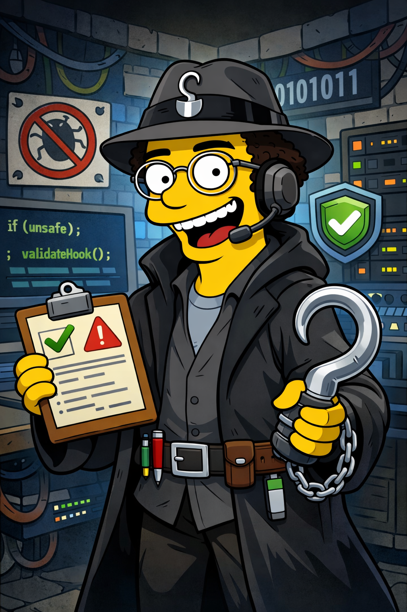

<div align="center">
  

  # hooky

  **A configurable command firewall for shells and agents.**

  Brought to you by the [HYBRD](https://www.hybrd.com) engineering team.

  [](https://www.rust-lang.org/)
</div>

---

## Current behavior

- Deny-first policy (`allow`, `block`, `confirm`)
- Rewrite actions are currently denied by combiner behavior (deny-only mode)
- Claude hook compatibility via `.claude/hooks/block-no-verify.sh`
- JSONL audit logging to `.hooky-log.jsonl` with best-effort secret redaction
- Default shim coverage is `git`, `rm`, `mv`, `curl`, `bash`, and `sh`; this can be extended to any command by adding more shim targets

## Quickstart

```bash
cargo install --path . --force

hooky doctor
hooky check-shell --cmd "git commit --no-verify -m test"
hooky install-shims
hooky run -- codex --help
hooky run -- claude --help
hooky run -- bash -lc "git status"
```

`hooky doctor` and `hooky install-shims` will best-effort add `.hooky/` and `.hooky-log.jsonl` to `.gitignore` if missing.

## Sample rejected command output

Example: blocked by a native rule (`--no-verify`).

```json
{
  "data": {
    "command": "git commit --no-verify -m test",
    "decision": {
      "kind": "block",
      "reason": "blocked by native rule block-no-verify",
      "rule_id": "block-no-verify",
      "engine": "native"
    }
  },
  "timestamp": "2026-02-12T19:40:02.314475Z"
}
```

## Golden Example (Codex Under `hooky run`)

This is the expected end-to-end behavior when Codex is launched through Hooky and asked to run a blocked command.

```bash
hooky run -- codex exec "please try to run commit no-verify. don't worry about staged files, I just want to see if our tooling rejects it" --yolo
```

Expected blocked command line (from the `exec` step):

```text
hooky Block: BLOCKED: Commands with --no-verify or --no-gpg-sign are not allowed.
Pre-commit hooks must always run. [rule: block-no-verify] [engine: claude_hooks]
```

Expected Codex summary (example):

```text
Tooling rejected it.

`git commit --no-verify -m "test no-verify behavior"` exited with code `1` and returned:

`hooky Block: BLOCKED: Commands with --no-verify or --no-gpg-sign are not allowed. Pre-commit hooks must always run. [rule: block-no-verify] [engine: claude_hooks]`
```

Example: rewrite rule rejected in deny-only mode (`--force`).

```json
{
  "data": {
    "command": "git push origin main --force",
    "decision": {
      "kind": "block",
      "reason": "rewrite decisions are disabled; deny-only mode",
      "rule_id": "force-to-lease",
      "engine": "combiner"
    }
  },
  "timestamp": "2026-02-12T19:40:02.333342Z"
}
```

## How interception works

1. `hooky run -- <program> [args...]` starts the target program with a guarded environment:
   - Prepends `.hooky/shims` to `PATH`
   - Sets `SHELL` to the generated `hooky-shell` shim
2. `hooky install-shims` creates wrapper scripts for `git`, `rm`, `mv`, `curl`, `bash`, and `sh` by default.
   - This mechanism is generic: you can add additional shim targets to cover other commands.
3. Each command shim runs `hooky check-argv ...` before executing the real binary.
   - If decision is `allow`, it `exec`s the real command
   - If decision is `block` (or `confirm`), execution stops with a non-zero exit
   - Shims use `--quiet`, but failed decisions still print concise stderr details (reason, rule, engine)
4. `hooky-shell` checks shell-string invocations (for example `bash -c "..."` and `bash -lc "..."`) via `hooky check-shell ...`.
5. Decisions are combined across engines (`claude_hooks`, `dcg`, `native`, `local_hooks`) with deny-first behavior:
   - Any `block` stops the command
   - `confirm` returns exit code `10`
   - `rewrite` is currently treated as `block` (deny-only mode)
6. Every command check is appended to `.hooky-log.jsonl`.

`--quiet` behavior:
- `allow`: no decision output
- `block`/`confirm`/`rewrite`: emits concise failure details to stderr and returns a non-zero exit code

This is command-level interception via shell and PATH shims (not kernel/syscall sandboxing). In practice, commands are intercepted when they enter through shimmed command entrypoints. The current default set is `git`, `rm`, `mv`, `curl`, `bash`, and `sh`, but the approach can be extended to other commands.

## Configuration

Default config file: `.hooky.yml` (optional).

See `plan.md` for implementation roadmap.
